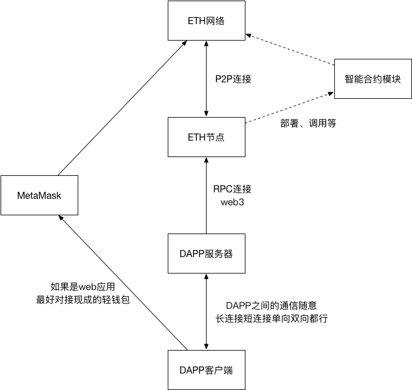
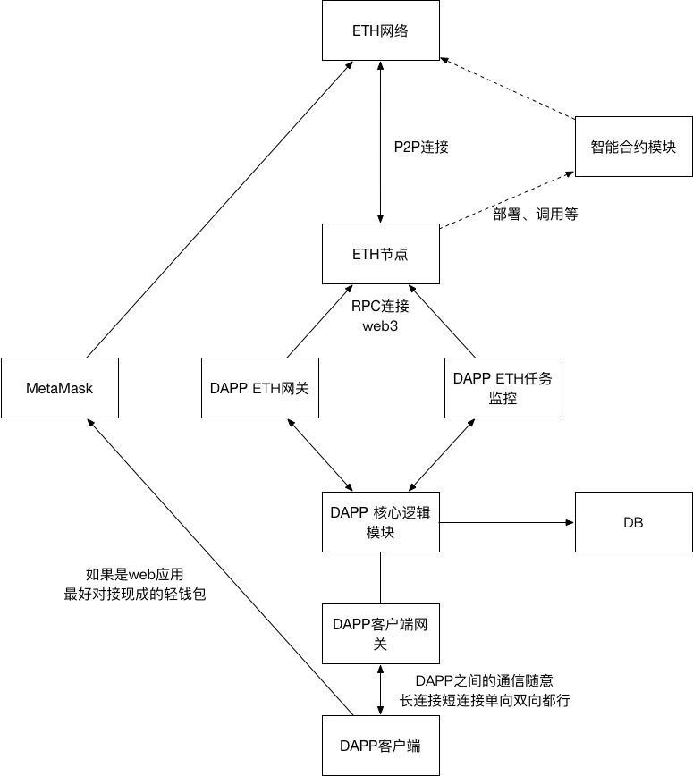

**缘由**

​    前几个月，负责了一个基于ETH的区块链项目，整个开发过程中，虽然能查到很多中文区块链资料，但其中大量都只是翻译国外的文档，一方面不是特别新，另外一方面就是缺乏实际落地应用支撑，所以才有了这篇文章的想法，希望能对正在参与ETH开发的同学有点点帮助。

**关于区块链**

​    区块链最近很火，但其实区块链的本质没那么复杂，BTC也没有解决特别神奇的问题，最主要的就是一个不安全的P2P网络环境下，解决了一个独立系统内部的货币流动问题（货币产生以及双花）。

​    这个其实很重要，目前我接触到的大部分区块链系统也都是如此，只处理自己系统内部的问题，而且是单链序列化的方式处理业务逻辑，就算是智能合约，为了保障智能合约的受信，也不允许任何外部数据的引用，然后，因为具体实现的分布性，甚至不能有和运行时间运行节点相关的操作。

​    而ETH呢，则是在BTC的基础上更进一步，是一台超级单线程计算机。

​    因为区块链最初的解释是分布式账本，所以可以理解为一个分布式的受信数据库，在BTC阶段，这里存放的数据都是事先约定好的（货币==），而到了ETH阶段，这里可以用来存放任意数据了，那么智能合约可以理解为在这个分布式数据库里的存储过程，他们暴露了一组接口来访问和修改各种数据。

​    所以在ETH里面，账户、实例化后的智能合约、数据等，其实都是这台超级计算机里的一段内存地址而已。

​    区块链的受信是基于怎样的原理产生的呢？

​    其实很简单，就是通过记账权（写入权）的不确定性来达成的，每个节点都进行同样的运算，因为不知道最终以谁的结果为准，所以作弊成本很高而已。

**ETH应用的最简模型**

​    如果把ETH网络整体想象成类Facebook这样的平台，其实DAPP和普通APP没什么区别，web3就相当于是一组平台API接口，智能合约，也就是用来存放需要上链的核心数据以及权限控制脚本而已。

​    其余该用数据库的还是应该用数据库，毕竟上链是有成本的（GAS和运行延迟）。

​    下面是我们项目最基本的结构图：

​    上图是一个简单的ETH应用结构，其中ETH网络就是现有的ETH网络，当然，开发阶段，也能用私链或测试链的（一开始就直接上公链的话，GAS开销太不合算了）。

​    ETH节点最好是一个我们自己部署的ETH节点，启动时需要开启RPC就好，用到的域都要开启的，这块如果用过geth控制台应该都知道。

​    因为我们的项目其实有一些中心化的部分，所以需要用到的关键ETH私钥也是要导入进去，重要的里面还要有ETH余额（很多操作都会有GAS开销）。

​    DAPP服务器，是我们最主要的开发服务器，前面也提过，因为DAPP的特殊性，不太可能把所有东西都放ETH链上，效率开销等都不合算，所以这里做规划时需要考虑清楚。这里除了通过web3来驱动ETH外，其它的和普通应用没太大区别，该有缓存该有自己的中心数据库的，最好都有，高并发高可用即可。

​    和ETH对接的就是web3，也就是一组RPC接口，接口方面和对接别的平台没什么特别的。

​    ETH的每个写入操作（消耗GAS的）几乎都是分2部分的，第一步是发布到链上，这时会得到一个地址，然后通过检查地址状态，确定该操作是否完成，可能很久才完成，这里需要考虑各种异常，以及服务器进程重启等。

​    DAPP客户端，这个没啥好说的，如果是web应用，建议还要接MetaMask，这样对用户来说会安全一些。

​    智能合约模块，这部分其实算是真正DAPP的核心了，最好只把需要放链上的部分放智能合约模块里，并尽可能精简。

​    智能合约虽然说是图灵完整，但成本和限制都很大，前期项目规划非常重要。还是那句话，搞清楚项目为什么用区块链来做，哪部分一定要上链，哪些部分不需要上链。

**ETH开发环境的搭建**

​    ETH现在环境搭建已经很简单了，基本上就是装个golang，然后下载geth代码编译就好。

​    如果是测试的话，建议自己做个私链就好，网上随便找个创世块配置，需要注意的是，运行geth的时候，有个数据目录，如果一台机器上，既有测试私链又有公链，只是这个目录配置成不一样的即可。

​    熟悉一下geth的控制台操作，你会发现web3的接口基本上就是这些的封装。

​    然后就是智能合约的开发环境，我们这边本地编码用的是VSCode（有Solidity插件），然后开发阶段会用Remix来测试，最后用Solc编译，通过自己的服务器用web3接口来部署。

​    IDE这块后来有人安利Atom下的一个插件Etheratom，可以本地连节点的RPC编译部署，同学也可以尝试一下。

​    我们项目，后端直接用的NodeJS，IDE也是VSCode，ETH的web3库，就直接用的web3.js。

​    前端也是web的，也是VSCode，没啥好说的了。

**web3 & Solidity**

​    web3基本上就是用RPC控制eth节点的API而已，大部分指令和geth控制台指令一致。

​    虽然ETH社区很活跃，但版本更新有点快，所以还是会遇到很多坑，我们主要用的是web3.js，中间就遇到个bug，github上看，应该是geth代码改动造成的，但说实话，web3.js处理也不严谨，差不多1个月没人管，后来我们自己想办法调用更底层的接口把这个bug回避掉了。

​    链上的所有操作都是2步的，一步是发布到链上，一步是最终确认，所以我们都没有直接用web3.js的接口处理最终的回调，而是将上链后的地址记下来，自己维护列表来查询状态的，这样一方面不会阻塞玩家操作，另外也不会由于服务器别的异常重启，对逻辑造成影响。

​    合约里，一般都会有一些只读接口，无GAS开销，但这部分接口其实延迟也很严重，我们这部分数据也都是自己缓存的，能不调用链上的接口就没调用链上的接口。

​    智能合约原理上，是需要在任意ETH节点上运行都得到同样的结果，所以完全不能主动从外部获得数据（不安全），取到的时间戳等也都和当前区块相关。

​    由于GAS规则的存在，智能合约里也不建议做大的遍历循环（甚至默认的map结构根本就不允许遍历），除了自己的逻辑尽可能使用外部缓存（在外部把参数筛选出来，直接传给智能合约，就能省掉很多排序遍历逻辑）外，因为现在区块链原理上是不支持并行的，所以我们也大量的用到了索引，来简化各种序列关系。

​    如果确实有一些很基本的功能，一定要在智能合约里实现，基本语法又不支持的话，建议优先找现成的实现，譬如随机数、可遍历map、排序等。

​    智能合约实例化以后，就是一个地址，只要你有它的ABI，就能调用开放的接口。

​    因此，Solidity加了很多限制语法，来保障安全性（这点上我是支持ETH的，EOS那样的完全用C++编译WASM的方案，虽然更方便，但同时也失去了特殊语法层面的防御措施），Solidity的很多版本更新都是类似这种，所以尽可能遵循最新的语法规范，尽可能在语法层面把安全性控制好。

​    智能合约一旦部署（实例化），代码就是不可更改的，就好像是C++对象一样，实例化以后，就是一个地址，万一我们后期要调整逻辑怎么办呢？

​    目前来看，比较理想的方式是数据和实现分离（类COM机制），把权限控制好（各种限制语法支撑），这样才能保障安全性的同时又留有一定的扩展性。

​    现在其实还有一批通用的ERC协议，开发者遵循这些协议规范，就会容易和第三方对接，而且多看看别人提交的议案，对自己的开发也会受益匪浅。

经过一定细化后的DAPP结构

​    聊了那么多，我们来把那个最简模型稍加细化吧。

​    大体的结构没变化，只是ETH相关的部分会变少很多，这也是我想传达的，DAPP开发其实并没有那么特殊。
