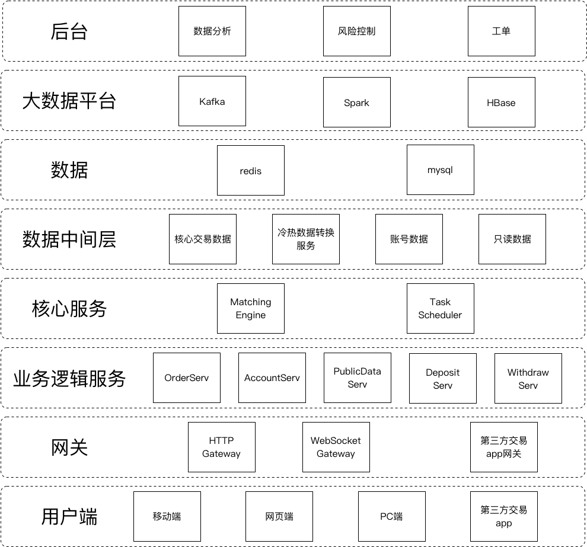

**关于作者：**  
分布式架构专家。  
多次从0开始搭建分布式服务架构，支撑数千万用户。  
商业运营近10年，核心架构没有重大调整。  
最新产品迭代开发，精致重构，全球运营2年无事故。  
7X24小时不间断运维更新。

**设计要求：**

1. 千万级用户（对标binance，百万级）。
2. 交易对可扩展（bitmex前面有段时间因为负载比较大，减少了一些交易对，我们应该要做到交易对可以完全的水平扩展）。
3. 峰值在线百万级（能显示看到的数据是bitmex，峰值2w多）。
4. 峰值单交易对活跃订单数不低于W级（bitmex单交易对订单数6k左右）。
5. 单交易对日交易频次千万级（bitmex日完整交易明细百万级别，流水$30Y）。
6. order规则向专业的交易所看齐，market、limit、止盈止损、隐藏、冰山、OCO、OTO等。
7. 安全稳定。
8. 7X24小时不间断交易。

**设计思路：**

1. 微服务架构，低耦合，易于分布式部署，易更新维护。
2. 大部分服务要能水平扩展。
3. 数据层安全稳定，一定程度上支持回滚。

**实现方案：**

**细节方案：**

***下面部分内容会和交易规则相关，交易规则可调整。**

1. 网关隔离客户端和实际服务层

好处很多，整体耦合度会更低，安全性更高等。

和其它平台类似，提供了HTTP、WebSocket网关 和 第三方交易APP网关，主要供我们自己的交易终端、API用户 和 第三方交易终端用户使用。

现在常见的交易所这块几乎都是json格式的数据，其实我们可以提供类似protobuf这样的数据格式，可读性和效率都会更高一些。

***在运维层面，网关前面可能还有一层运维隔离。**

2. 业务逻辑层

这里提供是普通的业务服务。

订单服务，这里是一个订单分派服务，按交易对分别维护订单队列。bitmex在未处理订单到达一个量级时，会显示的提示用户订单无法处理，这时其实和bitmex服务连接很顺畅，说明不是网络卡，而是逻辑层故意的处理，这样的好处是能在一个相对恒定的时间内收到返回，某些高频策略其实可以在阻塞时干脆直接放弃掉，另外一些策略则可以选择重试。

账户服务，账户的基本服务，修改配置，查询数据等。如果要进一步分细，可以把数据查询和数据修改分开，也可以根据实际细节业务逻辑进一步细分。

公共数据服务，就是公开的数据查询，主要是历史数据、order book、近期成交明细等。

入金服务，对于数字货币来说，需要为每个用户分配一个固定的地址，侦听该地址资金变化，实现自动化入金。法币的入金需要对接银行系统。

出金服务，这里可能需要审核，对接管理后台。

这里其实可能还有些服务没有写全，譬如社交聊天模块、商业信息推送模块等。

3. 交易撮合引擎

交易撮合引擎首先是按交易对分的，也就是一种交易对一个服务（其实对应后面的数据等，如果并发量很大，最好都这样分）。

交易撮合引擎就2个要求，第一是快，第二是万一出现问题，能有几乎无损的备用方案。

交易撮合引擎可以使用类似redis的实现方式，数据全展开在内存里，单线程处理，直接用C/C++实现。

如果后期并发量特别大，也有进一步的优化方案。

下面是限价订单的处理逻辑

hash索引和订单队列。

hash索引需要有2层，一个是内部的orderid，一个是clientorderid，方便api使用的。

订单队列根据具体的逻辑需求，会有不同的实现，下面是LimitOrderList。

这个LimitOrderList是一个双层链表，蓝色是主链，核心数据分别是价格和总量，这种结构可以很方便的处理价格击穿，如果并发量特别大，这里可以并行处理部分业务逻辑。

4. 任务调配器

做期货可能用得多一些，到期或者类似bitmex或bitflyer某些交易对，每隔8小时有一次费率机制保障期货价格不大幅偏离现货价格。

这种结算任务算法相对简单，但可能瞬时量很大，所以效率非常重要，根据具体任务来特定优化，每秒百万级。

5. 数据中间层

这部分分得比较细，主要也是降低耦合度。

核心交易数据是写入为主的，除了核心交易对以外，大部分是序列化的日志类数据。

账号数据，主要是为账号服务提供数据的，只读数据和账号配置数据。

只读数据，主要为公共数据服务提供数据，这里特别一点的是数据持久化时应该是未对齐的数据，终端显示的更多是一个对齐数据，所以会需要有数据清洗的工作，这部分工作可以放这里来做，也可以直接交给终端处理。

冷热数据转换服务，就是在redis内存数据和mysql持久化数据之间提供动态调整的服务。

数据具体落地时间和存放地点都是数据中间层内部决策，为外部服务提供统一稳定的数据。

6. 数据层

mysql和redis，多实例，主从，分库分表优化。

7. 大数据平台

和需求相关，暂不展开。

8. 后台

可以考虑用antdesign来实现。

9. 交易终端

网页端最优先，图形交易控件可以考虑用tradingview，或者拿开源控件（D3、EChart等）二次开发。
网页端要能适配移动设备。

PC端，可以用Electron开发，跨平台简单一些。前期直接拿H5加个壳也行。
移动端，如果要跨平台，可以用react native，前期直接H5加壳也行。

10. 对接第三方交易终端

类似tradingview的udf这样的，有些可能要单独做网关或插件。

11. 运维

Kubernetes，容器化。
微服务。
不间断服务运维。

12. 持续集成

工作流。
自动化。
